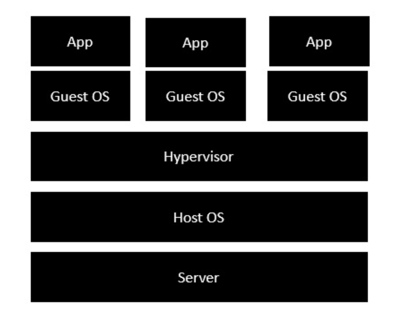
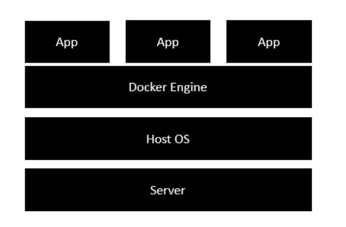

# What is Docker:

1. Docker is an open-source centralised platform designed to create , deploy and run applications.

2. It uses container on the host OS to run applications. It allows applications to use same linux kernel as a system
   on the host the computer rather then creating a whole new OS.

3. We can install docker on any OS but docker enginer run natively on Linux distribution.

4. Docker is written in GO language.

5. It is a tool that perform OS level virtualization also called Containerization.

6. Before docker many users/developers faced issue that application is running on one systems but not on other
   maybe because of libraries/dependancy issues.

7. It was first released in March 2013

8. Docker is a PAAS.


# Advantages of Docker:

1. No pre-allocation of RAM.

2. CI efficiency: Docker enables you to build a container image and use the same image accross various stages in
   deployment.

3. Less cost.

4. It can run on physical hardware/VM/Cloud.

5. Image can be reuse n number of time by dev/qa

6. It is helful to achieve agile and good for devops practice.

7. Docker has the ability to reduce the size of development by providing a smaller footprint of the operating
   system via containers.


# Disadvantages of Docker:

1. It is not good for application where it required GUI.

2. Difficult to manage large amount of containers.

3. It does not provide cross-platform compatiblity. Means if application is designed to run in windows container
   then it will not run on ubunto or macOS image.

4. It is good when development OS and testing OS are same, for different OS we should use VM

5. No solution for data recovery and backup.

# Docker - Architecture



1. The server is the physical server that is used to host multiple virtual machines
2. The Host OS is the base machine such as Linux or Window
3. The Hypervisor is either VMWare or Windows Hyper V that is used to host virtual machines
4. You would then install multiple operating systems as virtual machines on top of the existing hypervisor as
   Guest OS
5. You would then host your applications on top of each Guest OS.



1. The server is the physical server that is used to host multiple virtual machines. So this layer remains the same.
2. The Host OS is the base machine such as Linux or Windows. So this layer remains the same.
3. Now comes the new generation which is the Docker engine. This is used to run the operating system which earlier used to be virtual machines as Docker containers.
4. All of the Apps now run as Docker containers.
   
# Components of Docker:

### Docker Daemon 
    - It run on host OS.
    - It is responsible to run containers to manage docker service (agent in azure).


### Docker Client
    - Users can inteact with docker through docker client.
    - It used commands and API to communicate with docker daemon.
    - When a client run any commands on his docker terminal then it directly send to daemon.


### Docker Host
    It is used to provide an enviroment to execute and run applications. It contains docker daemon,
    images, containers, network, storage.


# Docker Hub
  It manages and stores docker images just like (Github).
   - Public Registry:  Where anyone can push and pull the image.
   - Private Registry: It is only access in one enterprise (any IT firm).


# Docker Image
  - It is read only template to create container. It is built by docker users.
  - Anyone can pull the image and create container out of it.
  - It can be stored in docker hub or local repo (azure repo).

### Ways to create docker image:
    - Take image from docker hub.
    - Create image from docker file.
    - Create image from existing docker file.


# Docker Container
  - Container holds entire packages that is need to run any application (libraries, dll).
  - It is like a VM.
  - Image becomes container when run on docker engine.

# Create Container from image:
  1. Login to you AWS account and start your EC2 instance and connect to it using putty.
  2. Create a containe first and then create image from it, so that everyone can use our image.
  ```
  docker run -it --name mayankcontainer ubuntu  /bin/bash
  cd tmp/  -> to go inside the tmp folder
  touch myfile   -> create one file inside tmp folder
  exit
  docker diff mayankcontainer   -> to check the difference between the base image and changes
  docker commit  newcontainer  updateimage  -> create image of this container
  docker images  -> to check whether image created or not
  docker ps -a  -> check count of containers
  docker run -it --name cloudcontainer updateimage /bin/bash
    -it means run in interactive mode
    /bin/bash is used to run the bash shell once container is up and running.

  Commands:
  now check whether myfile is located inside tmp or not
  ls
  cd tmp/ 
  ls

  ```

# Docker File

  It is basically a text file which contains some set of commands or instructions. 
  1. Create a file named it Dockerfile
  2. Build docker file to create image
  3. Run image to create container

  ```
  vi Dockerfile ->  Create docker file
  Press i 
  FROM Ubuntu
  RUN echo "I am devops engineer" > /tmp/testfile   -> it will create a file having some contents
  Press escape wq:

  Commands:
  docker build -it test .    -> . means current directory
  docker run -it --name testcontainer test /bin/bash
  ls
  cd tmp/
  ls
  cat testfile

  ```
 
  ```
  vi Dockerfile
  FROM Ubuntu
  WORKDIR /tmp  -> set directory
  RUN echo "hi this is mayank" > /tmp/testfile
  ENV myname mayank  -> set env variable 
  COPY testfile1 /tmp  -> copy file to tmp
  ADD test.tar.gz /tmp  -> extract and add to tmp
  esc :wq

  Commands:
  touch testfile1
  touch test
  tar -cvf test.tar test -> create tar file of test
  gzip test.tar   -> create zip of it
  ls
  docker build -t newimage.
  docker images
  docker run -it --name newcontainer newimage /bin/bash  -> create container
  ls
  cat testfile1
  echo $myname
  ```
 
# Docker Volume
  - It is a directory in our container.
  - Intially we have to declare this directory as a volume and then we can use it.
  - Even if container stop still we can access volume.
  - One container one volume.
  - You can share volume with any numbers of containers.
  - When you update your image then volume can't be updated.
  - You can mapped volume in 2-ways:
    1. Container <-> Container
    2. Host <-> Container

### Benifits of Volume
    - No data loss if container deleted.It is decoupled.
    - Share volume among containers

  ```
  vi Dockerfile
  FROM ubuntu
  VOLUME ["/myvolume"]
  
  Commands:

  docker build -t myimage .
  docker images
  docker run -it --name myvolume myimage /bin/bash
  ls
  cd myvolume/
  touch filex filey
  ls
  exit
  docker run -it --name container2 --priviliged=true --volumes-from container1 ubuntu /bin/bash
  ls
  cd myvolume/
  ls
  exit
  docker start container1
  docker attach container1 -> go inside the container
  ls
  cd myvolume/
  ls  

  We can create volume using commands:
  docker run -it --name container3 -v /volume2 ubuntu /bin/bash
  ```

  
# Docker Compose
  It is used to power multi container application where various services will be hosted inside different container.
  Container 1 -> Node.js
  Container 2 -> MongoDB
  Container 3 -> Angular

  We can create docker compose file using yaml syntax where we can define all 3 services like node, mongo and angular.

### Docker compose build
    It will build the multi container application.

# Docker Swarm
  - It is used to create a network of docker engines to execute container in parallel, like cluster of container.
  - It will helps in scaling up and down.
  - If one node/container fails then docker swarm will reschedule the container and manage the failure.
  - It has backup folder of any node fails then it will restore data in new node from backup location.

### Type of nodes
    - Manager Node: Manage all other nodes. Access status of other nodes.
    - Worked Node: All the task are done by worker node.

    Manager will assigns tasks to worker node.

  
